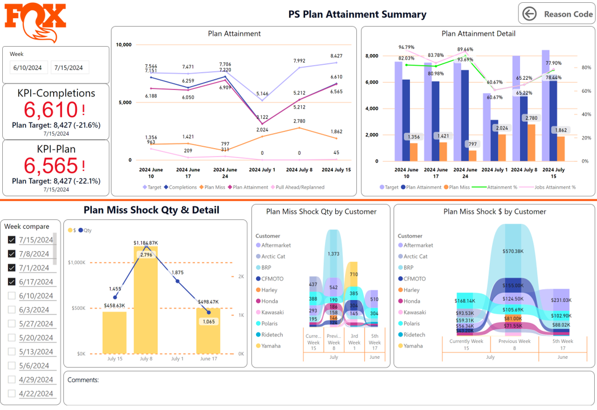
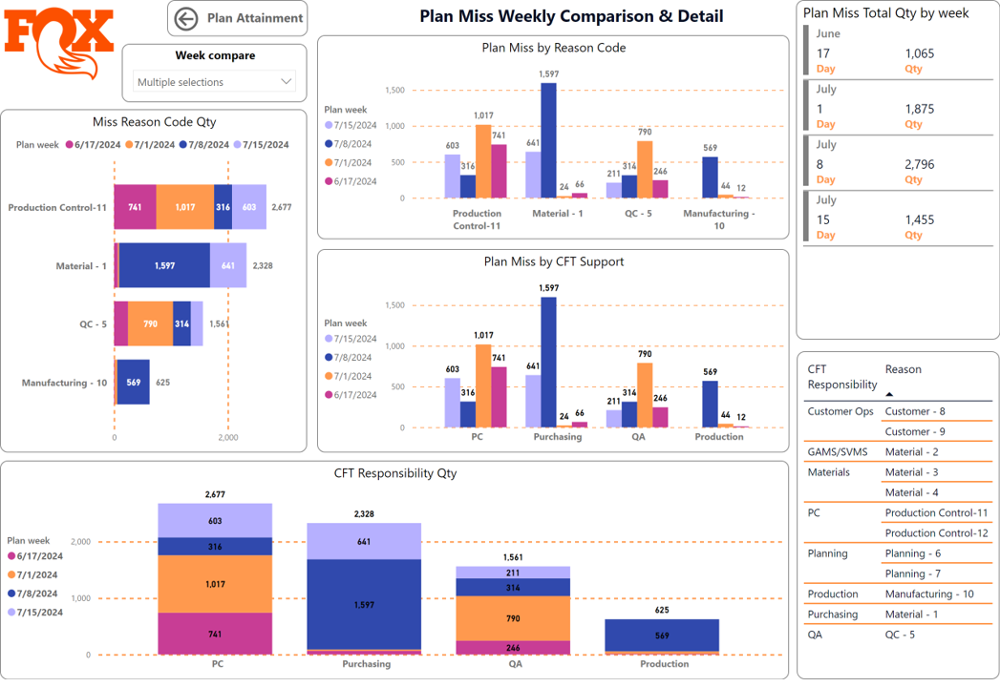
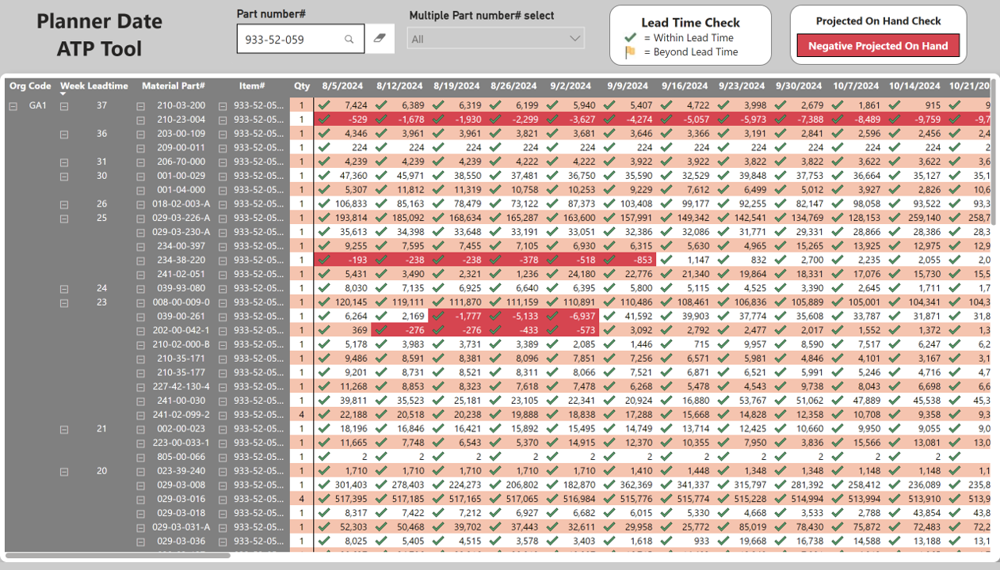
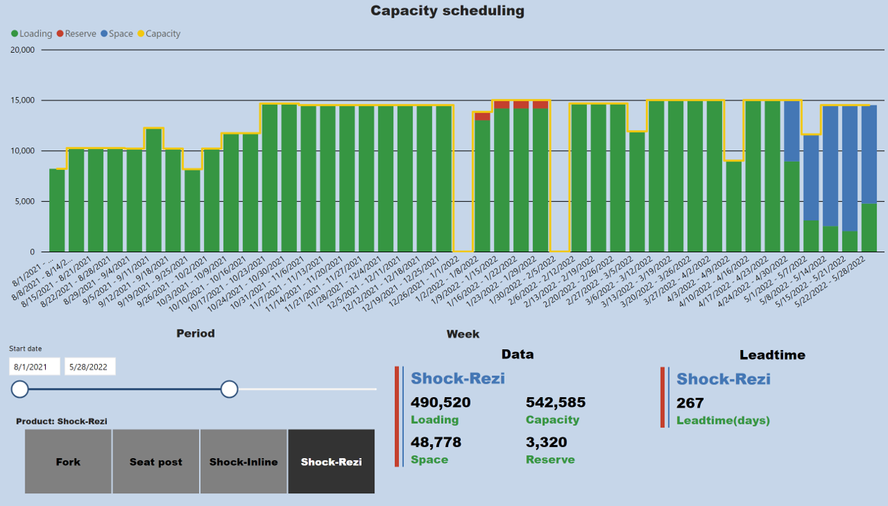

# Power BI Portfolio Projects

# About Me
I am a seasoned Power BI expert with over 6 years of experience in data visualization and business intelligence. My advanced skills include complex DAX formulas, efficient data modeling, and sophisticated data transformation using Power Query. I excel in creating custom visuals, optimizing performance, and integrating Power BI with various platforms. My passion lies in transforming raw data into actionable insights, enabling data-driven decision-making for organizations. 

# 1. Production Schedule Attainment Review

## Description
This tool present job attainment insights that helps manufacturing companies monitor and analyze their production performance against planned schedules. Visual representation of schedule adherence, using charts and graphs to show planned vs. actual production. Performance indicators for different production lines, departments, and products.

## Dashboard

## Key Insights

#### -Real-time tracking of production progress compared to scheduled targets.
#### -Identification of delays or bottlenecks in the production process.
#### -Historical data to show trends in schedule attainment over time.
#### -Breakdown work orders missed reason and responsibility by week.

# 2. Forecast Demand Planning Outlook

## Description
To visualize and manage demand forecasts for products or services. Typically leverages advanced analytics to provide accurate and actionable insights.

## Dashboard

## Key Insights

#### -Models consider various factors such as growth trends, seasonality, and special events.
#### -Visualizes growth trends over time, identifying whether demand is increasing or decreasing.
#### -Allows users to drill down into specific product categories and individual products.
#### -Identifies specific days with significantly higher or lower demand, influenced by holidays or events.
#### -Provides real-time insights as well as historical data to compare past forecasts with actual outcomes.

# 3. Material Shortage Overview

## Description
To provide a comprehensive view of material shortages across an organization's supply chain. Shows the quantity of demand that is not met or met late due to material shortages, compared to available supply.

## Dashboard

## Key Insights

#### -Quantifies the potential impact of shortages on production schedules, customer orders, and revenue
#### -Highlights suppliers associated with frequent or significant shortages.
#### -Incorporates demand forecasts to predict potential future shortages.

# 4. Available to Promise Analysis Tool

## Description
This tool present calculates the quantity of a product that is available for customer orders. It takes into account current inventory, material supply leadtime, planned production, and existing customer orders.

## Dashboard

## Key Insights

#### -Allows users to drill down into specific products, time periods, or customer segments for detailed analysis.
#### -Calculates the available-to-promise quantity by considering current inventory, incoming supply, and existing customer orders.
#### -Displays the real-time quantity of components available in inventory.
#### -Visualizes the timing and quantity of expected inventory arrivals.
  
# 5. Key Customers Capacity Allocation Project

## Description
To manage and visualize the allocation of resources to key customers within a project. Provides insights into how resources are distributed, ensuring that critical customers receive the necessary attention and capacity.

## Dashboard

## Key Insights

#### -Visual representation showing the distribution of resources across key customers.
#### -Helps identify underutilized or overutilized resources.
#### -Ensures that high-priority customers are given adequate capacity.
#### -Helps in understanding past allocation patterns and planning future capacity needs.

# 6. Production Capacity vs Sales Order Demand

## Description
Compares and analyzes the relationship between production capabilities and demand for products. Helps businesses optimize operations by aligning production with sales requirements. 

## Dashboard

## Key Insights

#### -Displays current production capacity utilization as a percentage.
#### -Includes forecasted demand based on historical data and predictive analytics.
#### -Side-by-side or overlaid charts comparing production capacity to sales demand.
#### -Shows capacity and demand metrics for different product lines.
#### -Incorporates sales forecasts to predict future demand and guide capacity planning.

