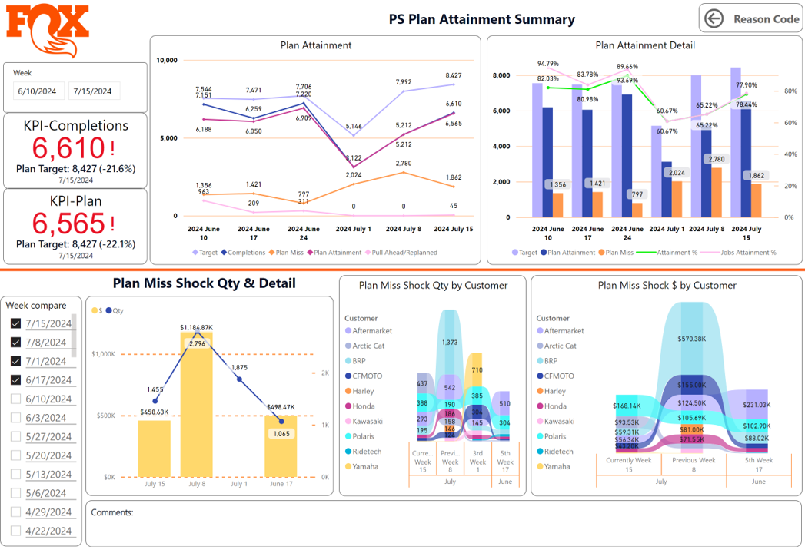
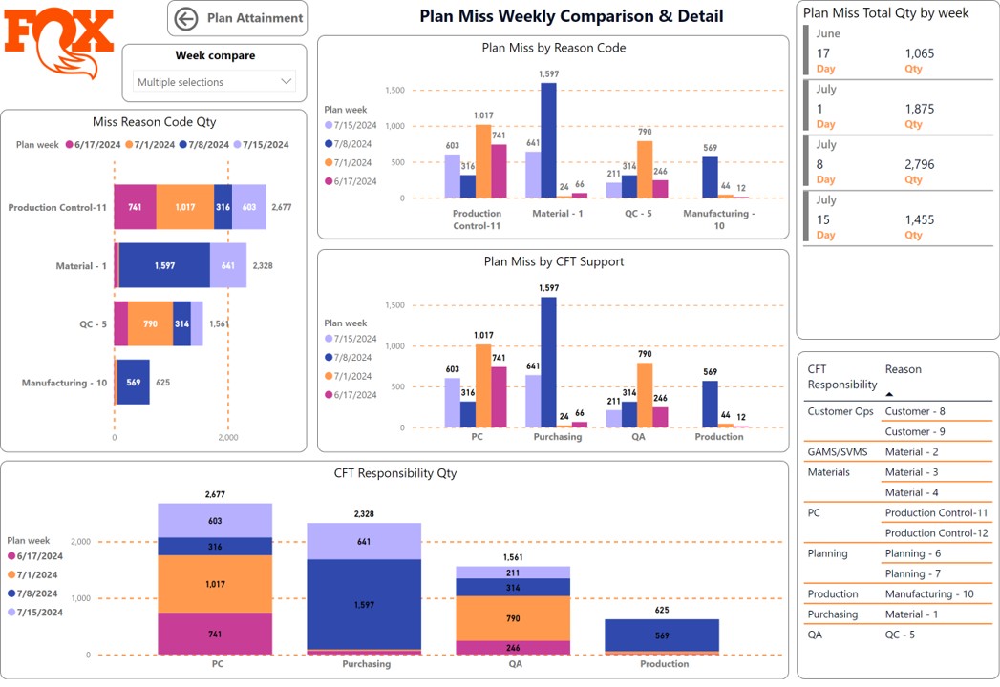
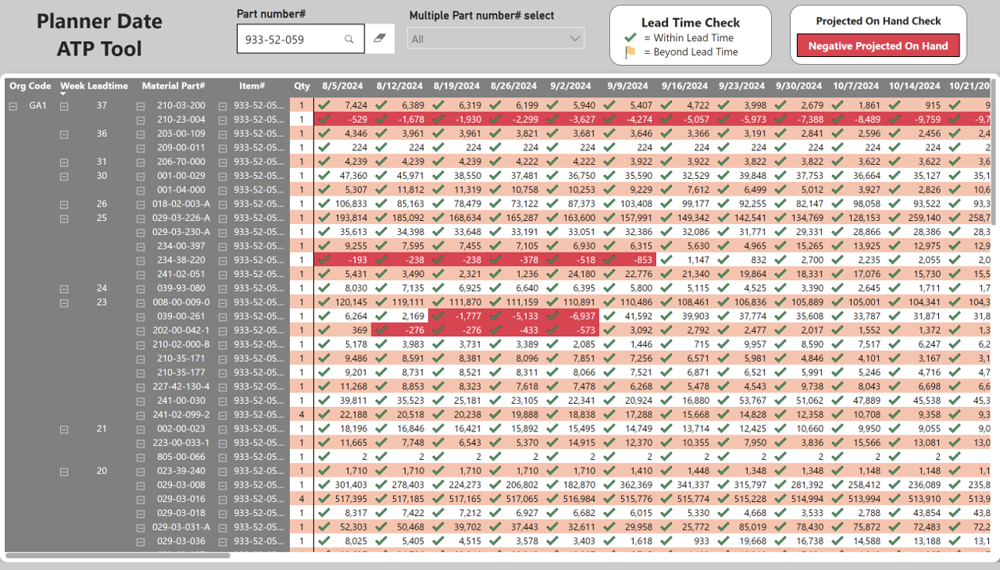
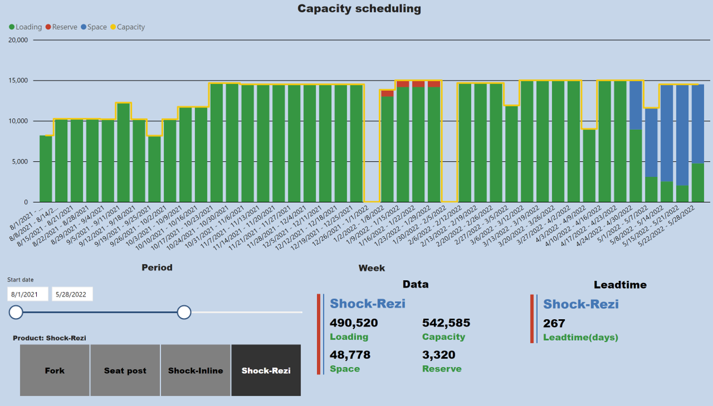

# Power BI Portfolio Projects

# About Me
I am a seasoned Power BI expert with over 8 years of experience in data visualization and business intelligence. My advanced skills include complex DAX formulas, efficient data modeling, and sophisticated data transformation using Power Query. I excel in creating custom visuals, optimizing performance, and integrating Power BI with various platforms. My passion lies in transforming raw data into actionable insights, enabling data-driven decision-making for organizations. 

# 1. Production Schedule Attainment Review

## Description
A strategic program tracking job attainment insights to help manufacturing leadership monitor production performance against planned schedules across multiple lines.

## Tech Stack 
Power BI (Advanced DAX), SQL.

## Dashboard

## Key Business Impact

#### -Root Cause Identification: Categorizes "Job Miss" reasons (e.g., material shortage, headcount, equipment) to drive data-driven accountability across departments.
#### -Performance Transparency: Provides real-time visibility into production adherence, reducing manual reporting time by 25%.
#### -Decision Support: Enables managers to identify bottlenecks instantly and reallocate resources to maintain delivery commitments.

# 2. Forecast Demand Planning Outlook

## Description
A sophisticated demand modeling tool designed to visualize and manage long-term forecasts by leveraging growth trends and seasonality.

## Tech Stack
Power BI, Statistical Forecasting, Scenario Planning.

## Dashboard

## Key Business Impact

#### -Strategic Alignment: Translates complex demand signals into 18-month rolling forecasts to align billion-dollar revenue goals with supply capabilities.
#### -Seasonality Insight: Identifies high/low demand periods (holidays, special events) to optimize inventory buffer strategies.
#### -Drill-Down Capability: Allows stakeholders to navigate from high-level categories down to individual SKU performance seamlessly.

# 3. Material Shortage Overview

## Description
A comprehensive supply chain risk management dashboard that quantifies potential revenue impact due to component shortages.

## Tech Stack
Power BI, MRP Integration, Risk Modeling.

## Dashboard

## Key Business Impact

#### -Revenue Protection: Predicts potential future shortages, allowing the team to secure alternative supply sources before production downtime occurs.
#### -Supplier Performance: Highlights frequent shortage patterns associated with specific suppliers to improve procurement negotiations.
#### -Proactive Mitigation: Links demand forecasts with material lead times to calculate the "Shortage Gap" in real-time.

# 4. Available to Promise Analytical Tool

## Description
An advanced logistics program that calculates real-time product availability by integrating inventory levels, supplier lead times, and customer demand.

## Tech Stack
Power BI, DAX, SQL, Oracle/ERP Data Integration.

## Dashboard

## Key Insights

#### -Automated Decision Making: Eliminated manual inventory checks, reducing order commitment time from hours to seconds.
#### -Risk Mitigation: Identifies potential supply gaps up to 4 weeks in advance, allowing proactive buffer stock adjustments.
#### -Cross-Functional Alignment: Synchronized global manufacturing receipts with U.S. sales forecasts to ensure 100% data transparency.
#### -Visualizes the timing and quantity of expected inventory arrivals.
  
# 5. Key Customers Capacity Allocation Project

## Description
A resource management project focused on prioritizing capacity for high-value customers to ensure strategic business objectives are met.

## Tech Stack
Power BI, Capacity Planning, Stakeholder Analytics.

## Dashboard

## Key Business Impact

#### -Resource Optimization: Visualizes the distribution of capacity across key accounts to prevent over/under-utilization of manufacturing lines.
#### -Priority Management: Ensures "Must-Win" customer demands are prioritized during peak cycles or material constraints.
#### -Analyzes past allocation patterns to guide future multi-year capacity investment decisions.

# 6. Production Capacity vs Sales Order Demand

## Description
A supply-demand balancing dashboard that compares manufacturing capabilities against actual sales order signals to identify scaling opportunities. 

## Tech Stack
Power BI, S&OP Modeling, Predictive Analytics.

## Dashboard

## Key Business Impact

#### -Scalability Analysis: Displays real-time capacity utilization percentage, identifying when and where to scale production infrastructure.
#### -Gap Closure: Side-by-side charts highlight "Supply-Demand Mismatches," enabling faster S&OP (Sales and Operations Planning) resolution.
#### -Predictive Planning: Incorporates sales forecasts to simulate "What-If" scenarios, optimizing long-term capital expenditure.
