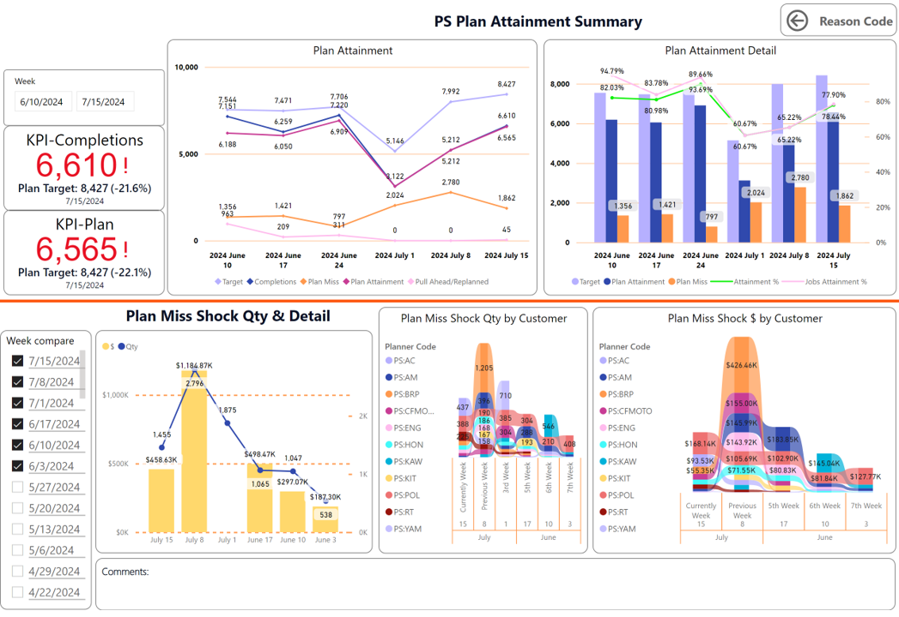
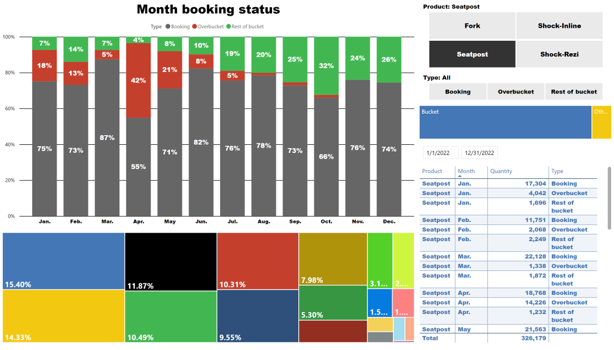

# Power BI Portfolio Projects

# About Me
I am a seasoned Power BI expert with over 6 years of experience in data visualization and business intelligence. My advanced skills include complex DAX formulas, efficient data modeling, and sophisticated data transformation using Power Query. I excel in creating custom visuals, optimizing performance, and integrating Power BI with various platforms. My passion lies in transforming raw data into actionable insights, enabling data-driven decision-making for organizations. 

# 1. Production schedule attainment review dashboard

## Description
This tool present job attainment insights that helps manufacturing companies monitor and analyze their production performance against planned schedules. Visual representation of schedule adherence, using charts and graphs to show planned vs. actual production. Performance indicators for different production lines, departments, and products.

## Dashboard

## Key Insights

#### -Real-time tracking of production progress compared to scheduled targets.
#### -Identification of delays or bottlenecks in the production process.
#### -Historical data to show trends in schedule attainment over time.
#### -Breakdown work orders missed reason and responsibility by week.

# 2. Forecast Demand planning outlook

## Description

## Dashboard

## Key Insights

#### -
#### -

# 3. Material shortage overview

## Description

## Dashboard

## Key Insights

#### -
#### -

# 4. Available to Promise analysis tool

## Description
This tool present calculates the quantity of a product that is available for customer orders. It takes into account current inventory, material supply leadtime, planned production, and existing customer orders.

## Dashboard

## Key Insights

#### -Material supply leadtime by different components and buyers
#### -The available date for new sales orders.
  
# 5. Demand and Supply Chain Horizontal Dashboard

## Description
This dashboard provides visualize and manage the intricate balance between demand and supply within an organization. includes all of the components and features to provide comprehensive insights into the supply chain by weekly demand and supply.

## Dashboard

## Key Insights

#### -Balance of finished goods and components inventory status
#### -Weekly supply chain overview for each components

# 6. Key customers capacity allocation project dashboard

## Description

## Dashboard

## Key Insights

#### -
#### -

# 7. Production Capacity vs Sales demand Dashboard

## Description
This dashboard provides insights into production capacity, forecast demand volume, and product delivery leadtime within the company.

## Dashboard

## Key Insights

#### -Production Capacity by weekly
#### -Finish goods delivery leadtime

